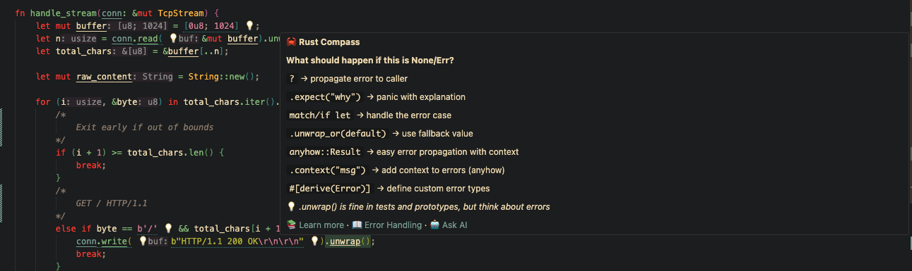
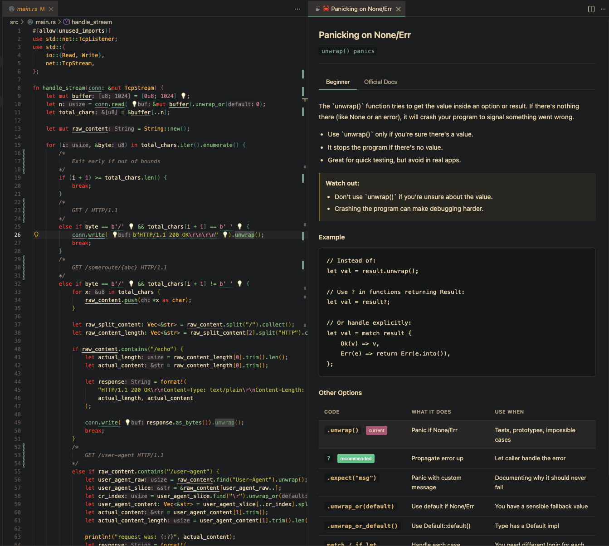
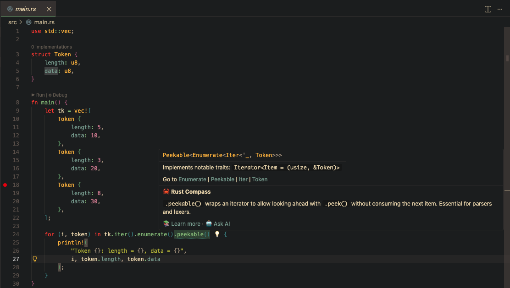

# Rust Compass

**Experimental**.  
The extension is in alpha.

Contextual Rust guidance for VS Code. Get explanations from official documentation while you code.

---

## Overview


## Why

You know Rust syntax and you've done the tutorials. But in a real project, you want to make good decisions while staying in flow and sometimes you just need a quick reminder of what `.iter()` vs `.into_iter()` actually does... again.

- `.iter()` or `.into_iter()`?
- Do I need `.peekable()` here?
- Is `.unwrap()` okay here or should I handle the error?

Rust Compass answers these questions right in your editor, pulling explanations from official Rust documentation with examples showing when to use what—or just explains a concept so you can make a better decision.

## Features

**Pattern Detection** — Recognizes common Rust patterns in your code: iterators, error handling, ownership, and more.

**Hover Hints** — Hover over detected patterns for a quick explanation and link to details.



**Learn Panel** — Click "Learn more" to open a sidebar with:
- Beginner-friendly explanation (simplified via Copilot)
- Official documentation from docs.rust-lang.org
- Comparison of related methods (e.g., all the ways to iterate)

> *Note: The beginner-friendly explanation requires GitHub Copilot for simplification. Without it, you'll still get the official documentation.*



**Bulb** — Quick fixes via the lightbulb menu when improvements are available.



## Settings

| Setting | Default | Description |
|---------|---------|-------------|
| `rustCompass.enabled` | `true` | Enable or disable hints |
| `rustCompass.projectContext` | `general` | Project type (`parser`, `web`, `cli`, `systems`) |
| `rustCompass.showDecorations` | `true` | Show inline decorations on detected patterns |

## Commands

Open the command palette (`Cmd+Shift+P` / `Ctrl+Shift+P`):

- `Rust Compass: Show Hint Panel`
- `Rust Compass: Toggle Hints`
- `Rust Compass: Set Project Context`

## How It Works

1. Rules in `rules/*.json` define patterns to detect (regex) and metadata
2. When you open a Rust file, the extension scans for matches
3. Hover triggers show inline hints
4. "Learn more" fetches the official docs and optionally simplifies them using VS Code's language model API

### Adding Rules

Create or edit files in `rules/`. Each rule needs:

```json
{
  "id": "iterator-collect",
  "pattern": "\\.collect\\s*[<:(]",
  "title": "Collecting an Iterator",
  "rustTerm": "Iterator::collect()",
  "explanation": "Transforms an iterator into a collection.",
  "example": "let v: Vec<_> = iter.collect();",
  "officialDoc": "https://doc.rust-lang.org/std/iter/trait.Iterator.html#method.collect",
  "confidence": 0.8,
  "contexts": ["general"]
}
```

## License

MIT
